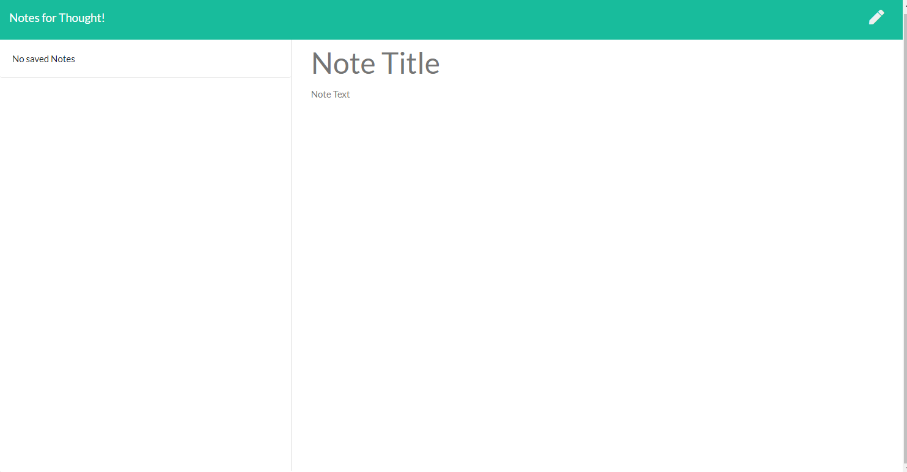

# Notes for Thoughts!

## Description

This is a note taking app. You will be able to create your own notes with a header and section for you to write in. 

Attached below will be a photo of what the repository will look like:

## Usage

In order to use this app, you will need Visual Studio Code and express. However, it is deployed on Heroku, so you will not need any of this unless you want to download it and try it for youself.

##  Questions

If you have any questions about the repository, please contact/email benny.le890@gmail.com  
My GitHub profile is found at [GitHub Profile](https//GitHub.com/bennyle890)